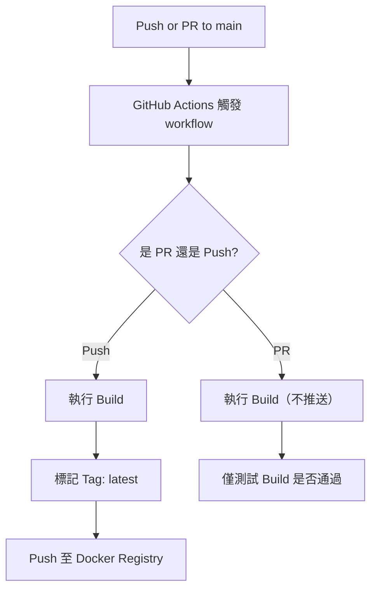

# Hello World App (Docker 版本)

這是一個超級簡單的 Node.js 應用程式，啟動後會在終端輸出 `Hello, World!`。

---

## 📦 如何使用 Docker 打包應用程式

1. **打開終端機**，切換到專案目錄。
2. 執行以下指令來建立 Docker 映像：

```bash
docker build -t hello-world-js .
```

## 🚀 如何透過 Docker 運行 Container Image

當你完成映像檔的建置後，可以透過以下指令來執行它：

```bash
docker run --rm hello-world-js
```

# 🐳 自動化建置與推送 Docker Image 說明

本專案使用 GitHub Actions 實現自動化建置與推送 Docker Image 至 Docker Registry（例如 Docker Hub）。

---

## 🧪 專案自動化建置流程圖

以下為專案的自動化流程邏輯：



---

## 🏷️ Tag 選擇邏輯說明

| 觸發類型       | Image Tag                         | 是否推送到 Registry |
| -------------- | --------------------------------- | ------------------- |
| Push to `main` | `latest`                          | ✅ 是               |
| PR to `main`   | 無實際 tag，僅測試 Build 是否成功 | ❌ 否               |

---

## 🔧 GitHub Actions 設定（路徑：`.github/workflows/docker-publish.yml`）

```yaml
name: Build and Push Docker Image

on:
    push:
        branches:
            - main
    pull_request:
        branches:
            - main

jobs:
    push-images:
        runs-on: ubuntu-latest

        steps:
            - name: Checkout code
              uses: actions/checkout@v4

            - name: Log in to Docker Registry
              run: echo "${{ secrets.DOCKER_PASSWORD }}" | docker login -u "${{ secrets.DOCKER_USERNAME }}" --password-stdin

            - name: Build Docker Image
              run: docker build -t 2025cloud/hello-world-js:latest .

            - name: Push Docker Image (only on push)
              if: github.event_name == 'push'
              run: docker push 2025cloud/hello-world-js:latest
```

---

## 🔐 GitHub Secrets 使用說明

| Secret 名稱       | 用途                         |
| ----------------- | ---------------------------- |
| `DOCKER_USERNAME` | Docker Registry 的使用者名稱 |
| `DOCKER_PASSWORD` | Docker 密碼或 Access Token   |

---

## 🧪 手動測試流程（本機測試）

```bash
# 建立 Docker Image
docker build -t 2025cloud/hello-world-js:latest .

# 登入 Docker Hub
docker login -u 你的帳號

# 推送到 Docker Registry
docker push 2025cloud/hello-world-js:latest
```

---

## 📦 目前推送的三個 Image（範例）

| Image 名稱                 | 說明                    |
| -------------------------- | ----------------------- |
| `2025cloud/hello-world-js` | 本專案自建 image        |
| `2025cloud/nginx-alpine`   | Retag 自 nginx:alpine   |
| `2025cloud/busybox`        | Retag 自 busybox:latest |
